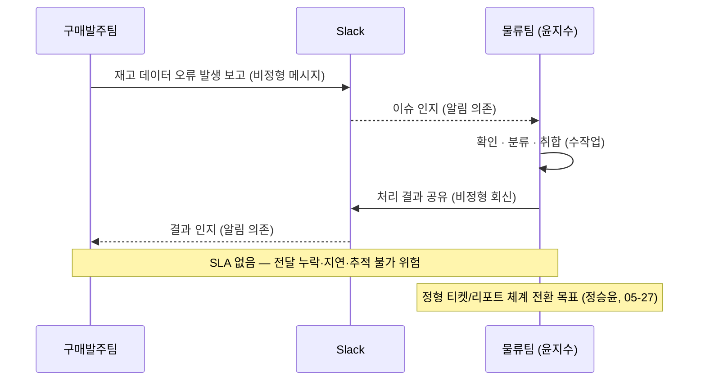

# 260506 물류파트 주간 운영 회의 (PMP Standard)

> 회의일자: 2026-05-06 (수) | 참석자: 윤지수 | 작성자: 윤지수 | 회의유형: 주간 운영 회의

---

## 1. 개요 (Meeting Overview)

- **목적:** 2026년 1~5월 재고관리 이슈 71건 정형화 결과 공유, fly.io 9종 출력 문서 전환 완료 보고, 후속 조치 과제 도출
- **일시:** 2026-05-06 (수)
- **장소:** 해당 없음 (기록 미확인)
- **참석자:** 윤지수
- **작성자:** 윤지수

---

## 2. 진척도 & KPI 업데이트 (Monitor/Control)

- **재고관리 이슈 누적 현황 (2026년 1~5월 5일 기준):** 총 **71건**

| 이슈 유형 | 건수 | 비율 | 비고 |
|---------|------|------|------|
| 입고자재 공란/위치 상이 | 21건 | 30% | 최다 — 입고 단계 입력 오류 |
| 기타 | 14건 | 20% | 유형 분류 추가 필요 |
| 재고생산 오류 (Material 번호·입고자재 누락) | 13건 | 18% | 2월 이후 반복 |
| TO 수량 미반영 | 12건 | 17% | TO 클로징 후 처리 누락 |
| 임가공 차감 오류 | 6건 | 8% | 가용재고 분리 관리 미비 |
| 기타 소계 | 5건 | 7% | — |

- **월별 추이:** 3월 피크(19건) → 4월 17건 고착 — 분기말 정산 영향 추정, 구조적 개선 필요
- **fly.io 전환 진척:** 9종 모두 완료 (완료율 100%)

---

## 3. 안건별 논의 및 의사결정 (Key Discussions & Decisions)

### 안건 1: 재고관리 이슈 정형화 — 월별 집계 체계 수립

- **논의 배경:** Slack `#scm_팀_재고관리` 채널에 이슈가 비정형으로 누적되어 패턴 분석·근본 원인 파악이 불가. 71건 중 입고자재 공란(30%)·재고생산 오류(18%)·TO 수량 미반영(17%)이 전체 65%를 차지하며 반복 발생 중.
- **주요 사례:**
  - 4월 20일 PNA51597(MM00207739) 입하장소·위치 상이
  - 4월 20일 PNA51619·PNA51368 입고자재 공란
  - 4월 27일 TO00015690·TO00015657 출고처리 미완료
  - 3월 MM00191394 아카이브 처리 후 입고수량 미반영
- **의사결정:** 월별 취합 보고 체계 유지 (Slack 채널 집계 → 정형 리포트). 구매발주 ↔ 물류팀 이슈 전달 RACI 및 SLA 정립은 5월 말 재논의.
- **결정 근거 / 기대 효과:** 현 취합 방식은 리소스 대비 즉시 실행 가능. 정형 리포트를 통해 반복 이슈 패턴을 가시화하여 근본 원인 조치 우선순위 결정 근거로 활용.

### 안건 2: 출력 문서 fly.io HTTP GET 엔드포인트 전환 완료

- **논의 배경:** 기존 로컬 Documint 방식은 담당자 PC 의존성·런타임 지연·유지보수 부담이 존재. 9종 출력 문서의 서버 이전 필요성 인지.
- **전환 범위:** TMS 출하확인서 / 외주임가공 Barcode(피킹리스트·라벨지·출하확인서) / 임가공(패킹리스트·라벨지·쉬핑마크) / 입하팀(고객물품 라벨지·입하물품 라벨지)
- **의사결정:** fly.io 단일 인프라로 확정 — Documint 의존 완전 제거. SLA 모니터링 구축은 후속 필수 과제.
- **결정 근거 / 기대 효과:** HTTP 요청 1회로 PDF 생성, 런타임 단축. 로컬 의존성 제거로 운영 안정성 향상. 단, SLA 모니터링 미구축 상태로 가용성 지표 설정이 후속 필수 과제.

**[현행 구조] 구매발주 ↔ 물류팀 이슈 전달 흐름 (Slack 의존)**

---

## 4. 이슈 & 리스크 관리 (Risks & Issues)

| # | 이슈 / 리스크 | 영향도 | 담당 | 조치 계획 |
|---|-------------|--------|------|---------|
| 1 | 입고자재 공란 21건 반복 — 입고 단계 필수값 미검증 구조 | 🔴 High | 윤지수 | 필수 필드 입력 검증 적용 (05-13까지) |
| 2 | 재고생산 오류 13건 — 입고자재·MM번호 누락 반복 (2월 이후) | 🔴 High | 윤지수 + 구매발주 | 납품 전 체크리스트 신설 (05-20까지) |
| 3 | fly.io 단일 인프라 SPOF — 서버 장애 시 전 문서 출력 불가 | 🟡 Med | 윤지수 | Backup 출력 경로 설계 (중기) |
| 4 | 구매발주 ↔ 물류팀 이슈 전달 Slack 의존 — SLA 없음 | 🟡 Med | 정승윤 | 정형 티켓 또는 리포트 체계 전환 (05-27) |

---

## 5. 실행 계획 (Direct & Manage Project Work)

### 5-A. 이전 Action Items 진행 현황 (Backward)

| NO | 업무 | 담당 | 기한 | 진행현황 |
|----|------|------|------|--------|
| 1 | 재고관리 이슈 취합 — 26년 1~5월 71건 정형화 | 물류팀 | 05-05 | 완료 |
| 2 | TMS 출하확인서 fly.io GET 전환 | 윤지수 | 05-06 | 완료 |
| 3 | 외주임가공 Barcode 3종 fly.io GET 전환 | 윤지수 | 05-06 | 완료 |
| 4 | 임가공 3종 fly.io GET 전환 | 윤지수 | 05-06 | 완료 |
| 5 | 입하팀 2종 fly.io GET 전환 | 윤지수 | 05-06 | 완료 |
| 6 | 입고자재 공란 방지 — 필수값 검증 방안 검토 | 물류팀 | 미정 | 예정 |
| 7 | TO 처리 후 입/출고 누락 방지 프로세스 확인 | 물류팀 | 미정 | 예정 |

### 5-B. 신규 Action Items (Forward)

| 우선순위 | 액션 아이템 | 담당자 | 기한 | 연계 Skill |
|---------|-----------|--------|------|-----------|
| 🔴 Critical | 입고자재 공란 21건 — 입고 단계 필수 필드 검증 적용 | 윤지수 | 05-13 | SK-01 |
| 🔴 Critical | 재고생산 오류 13건 — MM 번호·입고자재 누락 체크리스트 수립 | 윤지수 + 구매발주 | 05-20 | SK-02 |
| 🟠 High | TO 수량 미반영 12건 — TO 클로징 후 입/출고 처리 누락 진단 | 윤지수 | 05-13 | SK-03 |
| 🟠 High | fly.io 9종 SLA 모니터링 구축 (응답 P95 < 2s) | 윤지수 | 05-20 | SK-04 |
| 🟡 Medium | 구매발주 ↔ 물류팀 이슈 전달 체계 정형화 (Slack 의존 탈피) | 정승윤 | 05-27 | D3 |
| 🟡 Medium | 임가공 차감 이슈 6건 — 가용재고 별도 관리 방안 검토 | 윤지수 + 구매발주 | 06-03 | SK-01 |
| 🟢 Low | fly.io 엔드포인트 현장 사용자 URL 공유 및 안내 | 윤지수 | 05-09 | — |

---

## 6. 보류 / 펜딩 항목

| # | 안건 | 보류 사유 | 재논의 예정 |
|---|-----|---------|-----------|
| 1 | 구매발주 ↔ 물류팀 RACI 매트릭스 정립 | 팀 간 협의 일정 미조율 | 2026-05-27 |
| 2 | 아카이브 자재 Lifecycle 표준화 (자재 상태코드) | 구매발주팀 검토 필요 | 2026-06-03 |

---

## 7. 차기 회의 계획 (Next Steps & Closure)

- **차기 회의 일정:** 2026-05-13 (수)
- **예정 안건:**
  1. 입고자재 공란 방지 필수값 검증 적용 결과 공유
  2. 재고생산 오류 체크리스트 초안 검토
  3. fly.io SLA 모니터링 구축 현황
  4. 구매발주 ↔ 물류팀 이슈 전달 체계 정형화 방안 논의
- **특이 사항:** 해당 없음

---

> [!IMPORTANT]
> **PMP 관점 요약**
>
> - **Scope (범위):** 물류팀 업무 범위에 재고 이슈 정형화·보고 체계 운영이 공식 추가됨. fly.io 인프라 유지관리(SLA 모니터링) 업무 신설.
> - **Schedule (일정):** Critical 과제 2건 05-13·05-20 마감. SLA 구축 05-20. RACI 정립 05-27. 임가공 차감 검토 06-03.
> - **Risk (리스크):** 입고자재 공란(🔴) · 재고생산 오류(🔴) 두 건이 3~4월 반복 패턴 — 미조치 시 분기말 이슈 재연 가능. fly.io SPOF(🟡)는 중기 대응 필요.
> - **Financial Impact (재무 영향):** 재고생산 오류·TO 수량 미반영은 재제작·폐기 손실 직결 가능성 있음. 입고자재 공란 방치 시 재고 장부 불일치 → K-IFRS 기말 재고자산 과대/과소 계상 리스크.

---

*작성일: 2026-05-06 | 분석 에이전트: meeting-analysis SK-08 (PMP Standard)*
